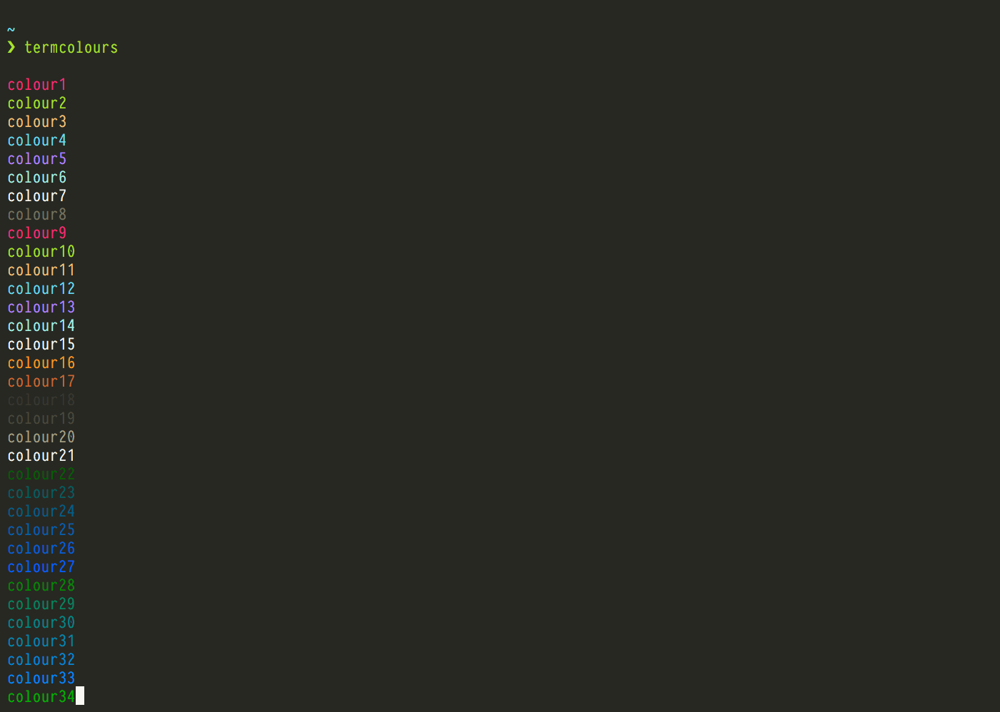

[![Slack Room][slack-badge]][slack-link]

# termcolours

Simple function for fish to list available terminal colour names.

## Install

With [fisherman]

```
fisher termcolours
```

## Usage

```fish
termcolours
```

## Screenshot



[travis-link]: https://travis-ci.org/fishery/termcolours
[travis-badge]: https://img.shields.io/travis/fishery/termcolours.svg?style=flat-square
[slack-link]: https://fisherman-wharf.herokuapp.com/
[slack-badge]: https://img.shields.io/badge/slack-join%20the%20chat-00B9FF.svg?style=flat-square
[fisherman]: https://github.com/fisherman/fisherman
